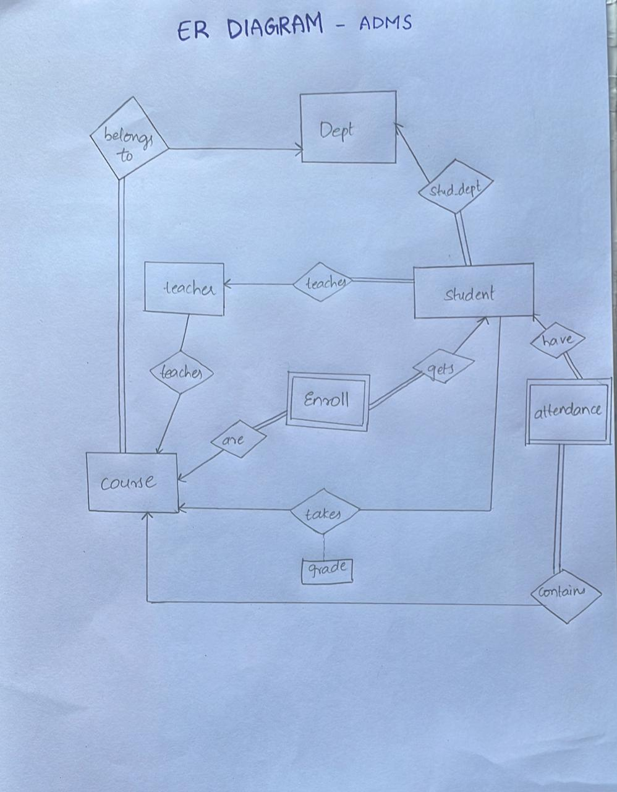

# 🎓 Academic Database Management System (ADMS)

<p align="center">
  
</p>

<p align="center">
  
  
  
  
  
</p>

<p align="center">
  <em>A centralised Academic Database Management System for universities — managing students, faculty, courses, attendance, and grades through a user-friendly interface.</em>
</p>

<p align="center">
  A Project Report submitted to <strong>Manipal Academy of Higher Education</strong><br/>
  for partial fulfilment of the requirement for the award of the degree of<br/>
  <strong>Bachelor of Technology in Computer and Communication Engineering</strong><br/>
  March 2023
</p>

---

## 👥 Team

| Name | Roll Number |
|---|---|
| Shreyas Goel | 210953001 |
| Veda Gurram | 210953015 |
| Sanjeev Kumar | 210953017 |

**Guided by:** Dr. Sumith N &nbsp;|&nbsp; Dr. Raghuvendra Achar  
Department of I&CT, Manipal Institute of Technology, Manipal, Karnataka, India

---

## 📋 Table of Contents

- [Abstract](#-abstract)
- [Features](#-features)
- [Database Design](#-database-design)
- [ER Diagram](#-er-diagram)
- [Database Tables](#-database-tables)
- [Tech Stack](#-tech-stack)
- [System Workflow](#-system-workflow)
- [Installation](#-installation)
- [Results](#-results)
- [Conclusion & Future Work](#-conclusion--future-work)
- [References](#-references)

---

## 📝 Abstract

This paper describes the design and implementation of an **Academic Database Management System (ADMS)** that simplifies academic record management. The ADMS provides universities and colleges with a centralised platform for storing and managing:

-  Student records
-  Faculty information
-  Course information
-  Administrative data

Built using modern web technologies with an Agile development approach, the system features a scalable architecture and a user-friendly interface. The ADMS directly contributes to the **UN Sustainable Development Goal — Quality Education** by improving the efficiency and accuracy of academic record management.

> **ACM Taxonomy:** Data management systems · Database design and modeling · Data storage representations · Information systems applications

---

## ✨ Features

-  **Authenticated Access** — Only verified users can log in and access their data
-  **Course Enrollment** — Students can browse and enroll in department-offered courses
-  **Attendance Tracking** — Teachers record attendance; students can view their full attendance history across all enrolled courses
- **Grade Management** — Instructors submit final grades; the system calculates and displays results in each student's personal record
-  **Profile Management** — Students and teachers can view and update personal information
- **Centralised Repository** — Single source of truth for all academic data across the institution

---

##  Database Design

The ADMS is built around a well-normalised relational schema derived from the ER model below.

###  ER Diagram

<p align="center">
  
  <br/>
  <em>Figure 1: Entity-Relationship Diagram for ADMS</em>
</p>

The ER diagram captures the following key relationships:

- **Student** `belongs_to` → **Dept** (via `stud_dept`)
- **Student** ← `teacher` → **Teacher** (faculty assigned to students)
- **Student** `gets` → **Enroll** (course enrollments)
- **Student** `have` → **Attendance** (via `contains`)
- **Course** `are` → **Enroll** (courses in enrollment)
- **Course** `takes` → **Grade** (grades per course)
- **Teacher** `teaches` → **Course**

---

##  Database Tables

| Table | Description |
|---|---|
| **Student** | Basic information about each student |
| **Teacher** | Information about teaching faculty |
| **Dept** | Departments offered by the college |
| **Courses** | Courses offered by each department |
| **Enroll** | Courses taken by each student |
| **Attendance** | Student attendance records per course |

---

##  Tech Stack

| Category | Technology |
|---|---|
| Frontend | HTML5, JavaScript (ES6+) |
| Query Language | SQL |
| Database | MySQL |
| Development Methodology | Agile |
| Architecture | Single-server, open-source stack |

---

## ⚙️ System Workflow

```
┌──────────────────────────────────────────────────────────────────┐
│                        ADMS WORKFLOW                             │
├──────────────────────────────────────────────────────────────────┤
│                                                                  │
│        Student / Teacher Login (Unique Credentials)             │
│                          │                                       │
│           ┌──────────────┴──────────────┐                        │
│           ▼                             ▼                        │
│  ┌─────────────────┐         ┌──────────────────┐               │
│  │  STUDENT PORTAL  │         │  TEACHER PORTAL  │               │
│  ├─────────────────┤         ├──────────────────┤               │
│  │ • Enroll Course │         │ • Mark Attendance│               │
│  │ • View Attend.  │         │ • Submit Grades  │               │
│  │ • View Grades   │         │ • View Roster    │               │
│  │ • Edit Profile  │         │ • Edit Profile   │               │
│  └────────┬────────┘         └────────┬─────────┘               │
│           └──────────────┬────────────┘                          │
│                          ▼                                       │
│       ┌──────────────────────────────────────┐                   │
│       │         ADMS DATABASE (MySQL)         │                   │
│       │  Student | Teacher | Dept | Courses   │                   │
│       │  Enroll  | Attendance | Grades        │                   │
│       └──────────────────────────────────────┘                   │
└──────────────────────────────────────────────────────────────────┘
```

---

## 💾 Installation

### Prerequisites

- MySQL Server
- A modern web browser
- Local web server (e.g. XAMPP / WAMP / Node.js)

### 1. Clone the repository

```bash
git clone https://github.com/your-username/adms.git
cd adms
```

### 2. Set up the database

```sql
CREATE DATABASE adms;
USE adms;
-- Run the provided schema.sql to create all tables
SOURCE schema.sql;
```

### 3. Configure the database connection

Update the DB credentials in your config file:

```javascript
const db = {
  host: "localhost",
  user: "root",
  password: "your_password",   // ← update this
  database: "adms"
};
```

### 4. Run the application

Serve the project via your local web server and open `index.html` in a browser.

---

## 📊 Results

The ADMS was successfully developed and tested. Key outcomes:

- ✅ Users can create and manage student records, courses, attendance, and grades
- ✅ Role-based access control ensures only authenticated users can access the system
- ✅ Users can only view and modify data they have been explicitly granted access to
- ✅ The interface provides simple, intuitive navigation for both students and faculty

---

## 🏁 Conclusion & Future Work

The ADMS successfully meets both functional and non-functional requirements, providing a user-friendly interface for managing academic records while maintaining **data integrity and security**.

### 🚀 Planned Future Enhancements

| Enhancement | Description |
|---|---|
| Task Dependencies | Link related tasks and course activities with dependency tracking |
| Notifications | Alert students and teachers about deadlines, grades, and attendance |
| Scalability Optimisation | Extend the system to handle large volumes of data and concurrent users |
| Additional Biometric Integration | Explore automated attendance via biometric or facial recognition |

---

##  References

1. R. Elmasri and S. B. Navathe, *Fundamentals of Database Systems*, 7th ed. Boston, MA: Pearson, 2016.

